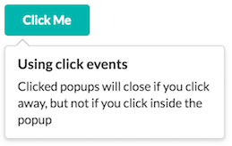
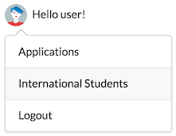

# semantic-ui-popup-canjs
CanJS wrapper around SemanticUI Popup component

A [can.view.attr](https://canjs.com/docs/can.view.attr.html) wrapper around [SemanticUI popup](http://semantic-ui.com/modules/popup.html). With `can.view.attr` you can add custom behavior to elements that contain a specified html attribute. Since SemanticUI is a set of jQuery plugins, `can.view.attr` is a natural way to invoke them in a [CanJS](https://canjs.com) or [DoneJS](https://donejs.com/) application.

This wrapper allows you to use SemanticUI popup with just html, no need to run jQuery plugin yourself.

SemanticUI's CSS should be imported separately. You can use `semantic-ui-less` package as in this demo.

[Settings](http://semantic-ui.com/modules/popup.html#/settings) of the popup can be defined as "semantic"-prefixed attributes. E.g. to define `position` as `bottom left` you can add `semantic-position="bottom left"` attribute (see Usage section).

If you need to use SemanticUI Popup `callbacks` then you are probably a jQuery-style developer and you don't need this wrapper :)

## Demo

See the included demo /demo/demo.html (run `npm install`, then `http-server` in the project root and browse /demo/demo.html).

 

## Installation
```
npm install semantic-ui-popup-canjs --save
```

## Usage
```
   With default settings:
   <div class="ui icon button" semantic-popup data-content="Add users to your feed">Add</div>

   With custom settings:
   <a class="browse" semantic-popup
                     semantic-inline="true"
                     semantic-on="click"
                     semantic-position="bottom left">Button</a>
```

## API

Attributes:
- `semantic-popup` - main attribute to invoke the wrapper
- `semantic-*` - use any of SemanticUI Popup settings with this prefix. E.g. `semantic-position="bottom left"` or  `semantic-hoverable="true"`.

## Contributing
Pull requests are welcome.

## Authors
- [Ilya Fadeev](https://github.com/ilyavf)
